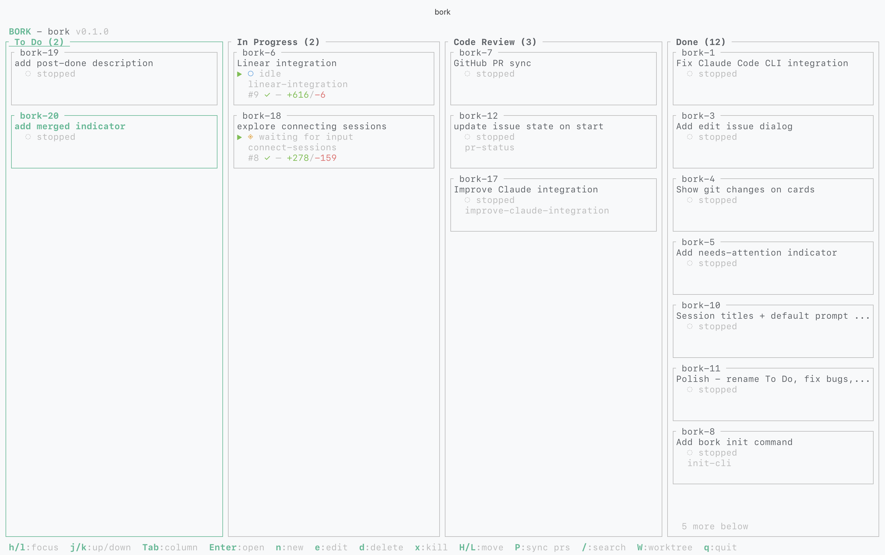
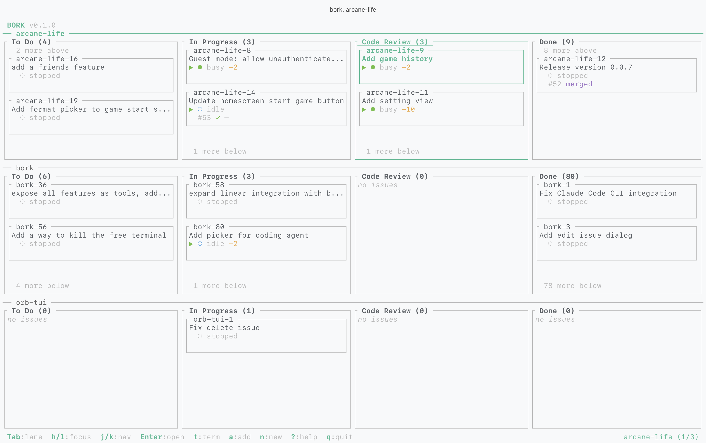

<div align="center">

# bork

**Terminal kanban board for orchestrating AI coding sessions across git worktrees and tmux.**

[](LICENSE)
[](https://www.rust-lang.org/)
[](https://ratatui.rs/)

</div>

---

<p align="center">
  
  <br>
  <sub>Adapts to your terminal theme (ANSI 16 colors)</sub>
</p>

## Overview

Bork is a terminal UI for managing multiple AI coding sessions. It gives you a 4-column kanban board where each issue maps to a git worktree and a tmux session running [OpenCode](https://opencode.ai), [Claude Code](https://docs.anthropic.com/en/docs/claude-code), or [Codex](https://developers.openai.com/codex). Switch between sessions with a keypress, see agent status at a glance, and keep your work organized. Register multiple projects and view them side-by-side in stacked swimlanes.

## Quickstart

You need [tmux](https://github.com/tmux/tmux), [git](https://git-scm.com/), a [Rust toolchain](https://rustup.rs/), and at least one AI coding agent ([OpenCode](https://opencode.ai), [Claude Code](https://docs.anthropic.com/en/docs/claude-code), or [Codex](https://developers.openai.com/codex)).

**1. Install bork**

```bash
git clone https://github.com/villads-valur/bork.git
cd bork
cargo build --release
# Add to PATH (pick one)
ln -sf "$(pwd)/target/release/bork" /opt/homebrew/bin/bork   # macOS
sudo ln -sf "$(pwd)/target/release/bork" /usr/local/bin/bork # Linux
```

**2. Set up a project**

```bash
bork init owner/repo          # GitHub shorthand
bork init git@github.com:owner/repo.git   # or SSH/HTTPS URL
```

This clones the repo, scaffolds the `.bork/` directory, and installs agent status hooks automatically.

**3. Launch**

```bash
cd repo
bork
```

Press `n` to create an issue, `Enter` to launch an agent session. You're up and running.

## Features

- **4-column kanban board** &mdash; To Do, In Progress, Code Review, Done
- **AI agent sessions** &mdash; Launch OpenCode, Claude Code, or Codex per issue in tmux popups
- **Session resumption** &mdash; Closing a tmux popup and reopening it continues the same conversation, not a fresh one
- **Real-time status monitoring** &mdash; See agent state on each card (Idle, Busy, Waiting, Error)
- **GitHub PR status** &mdash; Background polling shows checks, review status, and diff stats on cards
- **Dev server detection** &mdash; Automatically detects listening TCP ports per session and shows a 🔌 indicator on the card
- **Git worktree tracking** &mdash; Live staged/unstaged change counts and branch names
- **Tmux integration** &mdash; Auto-wraps in tmux, sessions open as 90% screen popups
- **Plan, Build, and Yolo modes** &mdash; Toggle between modes per issue; Claude and Codex support Yolo (skips all permission prompts)
- **Vim-style navigation** &mdash; h/j/k/l, g/G, and familiar modal keybindings
- **ANSI 16 colors** &mdash; Adapts to any terminal theme, no hardcoded RGB
- **Linear integration** &mdash; Import and attach Linear issues, sync state bidirectionally, open in Linear with a keypress
- **Auto-import PRs** &mdash; Open PRs authored by you are automatically added to the Code Review column
- **Search and filter** &mdash; Type `/` to fuzzy-filter the board by title or issue ID
- **Issue kinds** &mdash; Agentic issues launch AI sessions; non-agentic "todo" items skip the agent entirely
- **Multi-project view** &mdash; Register multiple projects and view them in stacked swimlanes with a collapsible project sidebar
- **Zero-dependency state** &mdash; JSON file persistence with atomic writes, no database

## Requirements

| Dependency | Purpose |
|------------|---------|
| [tmux](https://github.com/tmux/tmux) | Session management and popup overlays |
| [git](https://git-scm.com/) | Worktree status and branch detection |
| [gh](https://cli.github.com/) | GitHub PR status polling (optional) |
| [linear](https://linear.app/docs/cli) | Linear issue import and sync (optional) |
| [OpenCode](https://opencode.ai), [Claude Code](https://docs.anthropic.com/en/docs/claude-code), or [Codex](https://developers.openai.com/codex) | AI coding agent (at least one) |
| [Rust toolchain](https://rustup.rs/) | Building from source |

## Installation

### From source

```bash
git clone https://github.com/villads-valur/bork.git
cd bork
cargo build --release
```

Then symlink or copy the binary somewhere on your `$PATH`:

```bash
# macOS (Homebrew prefix)
ln -sf "$(pwd)/target/release/bork" /opt/homebrew/bin/bork

# Linux
sudo ln -sf "$(pwd)/target/release/bork" /usr/local/bin/bork
```

Verify it works:

```bash
bork --help
```

## Usage

| Command | Description |
|---------|-------------|
| `bork` | Launch the TUI kanban board |
| `bork init <repo>` | Set up a new bork project from a git repo |
| `bork install` | Install agent status hooks |
| `bork worktree <id> [slug]` | Create a git worktree for an issue |
| `bork uninstall` | Remove agent status hooks |
| `bork project list` | List all registered projects |
| `bork project add [path]` | Register a project (defaults to current directory) |
| `bork project remove [path]` | Unregister a project |

### `bork init`

Sets up a new bork project by cloning a repo and scaffolding the container directory structure.

```bash
bork init owner/repo                      # GitHub shorthand (clones via HTTPS)
bork init git@github.com:owner/repo.git   # SSH URL
bork init https://github.com/owner/repo   # HTTPS URL
bork init owner/repo myproject            # Custom directory name
bork init owner/repo --agent claude       # Use Claude Code instead of OpenCode
bork init owner/repo --agent codex        # Use Codex instead of OpenCode
```

This creates:

```
repo/                        # Container directory
├── .bork/                   # Config, state, agent status
│   ├── config.toml
│   ├── state.json
│   └── agent-status/
├── main/                    # Main branch worktree (the cloned repo)
├── opencode.jsonc           # OpenCode config
└── .claude/skills/worktree/ # Worktree skill for Claude Code
```

Agent status hooks are installed automatically and the project is registered in the global project registry (`~/.config/bork/projects.json`). The directory name defaults to the repo name, or you can pass a second argument to override it.

### `bork install` / `bork uninstall`

Bork ships with hooks that report agent status (Idle, Busy, Waiting, Error) back to the board in real time.

- **OpenCode**: Installs as a plugin
- **Claude Code**: Adds hooks to `settings.json`
- **Codex**: Adds hooks to `~/.codex/hooks.json` and enables `features.codex_hooks = true` in `~/.codex/config.toml`

These are installed automatically by `bork init`. Use `bork install` / `bork uninstall` to manage them manually.

## Keybindings

### Board Navigation

| Key | Action |
|-----|--------|
| `j` / `Down` | Move selection down |
| `k` / `Up` | Move selection up |
| `h` | Focus left (within column, then wrap to previous) |
| `l` | Focus right (within column, then wrap to next) |
| `Left` | Jump to previous column |
| `Right` | Jump to next column |
| `Tab` | Jump to next column (or switch swimlane if multiple visible) |
| `Shift+Tab` | Jump to previous column (or switch swimlane if multiple visible) |
| `g` | Scroll to top |
| `G` | Scroll to bottom |
| `Enter` | Open session (resume or launch if none, attach if running) |
| `Ctrl+P` | Toggle project sidebar |
| `P` | Force-sync PR statuses from GitHub |
| `o` | Open PR in browser (if issue has a matching PR) |
| `t` | Open project-root terminal in tmux |
| `/` | Search / filter board |
| `?` | Show keybinding help overlay |
| `I` | Import issue from Linear |
| `O` | Open linked Linear issue in browser |
| `q` / `Ctrl+c` | Quit |

### Issue Management

| Key | Action |
|-----|--------|
| `n` | Create new issue |
| `e` | Edit selected issue |
| `d` | Delete issue (with confirmation) |
| `x` | Kill session (with confirmation) |
| `a` | Add issue in current column |
| `H` | Move issue to previous column |
| `L` | Move issue to next column |
| `D` | Move issue directly to Done |
| `T` | Move issue directly to To Do |
| `W` | Reassign worktree |

### Dialog Mode

| Key | Action |
|-----|--------|
| `Tab` / `Enter` | Next field (auto-submits from last field) |
| `Shift+Tab` | Previous field |
| `Shift+Enter` | Submit from any field |
| `Ctrl+e` | Open prompt in `$EDITOR` (on Prompt field) |
| `Esc` / `Ctrl+c` | Cancel |
| `Space` / `h` / `l` | Cycle mode (on Mode field); open Linear picker (on Linear field) |

### Sidebar Mode

| Key | Action |
|-----|--------|
| `j` / `Down` | Move selection down |
| `k` / `Up` | Move selection up |
| `Enter` | Focus selected project (single board view) |
| `Space` | Toggle project as swimlane (add/remove from view) |
| `Esc` / `Ctrl+P` | Close sidebar |

### Confirm Mode

| Key | Action |
|-----|--------|
| `y` / `Enter` | Confirm |
| `n` / `Esc` | Cancel |

## Configuration

Bork looks for a `.bork/` directory by walking up from the current working directory. Configuration lives at `.bork/config.toml`:

```toml
project_name = "myproject"       # Issue ID prefix (e.g. myproject-1, myproject-2)
agent_kind = "opencode"          # Default agent: "opencode", "claude", or "codex"
default_prompt = "Check AGENTS.md for project context and start working on the issue."
```

### State

Issue data is stored in `.bork/state.json` as a flat JSON array. Writes are atomic (write to temp file, then rename) so state is never corrupted even if bork crashes.

Agent status files are written to `.bork/agent-status/` by the hooks installed with `bork install`.

### Global Project Registry

Bork maintains a registry of all your projects at `~/.config/bork/projects.json`. Projects are automatically registered when you run `bork init` or launch the TUI. Projects whose directories no longer exist are automatically removed from the registry. You can also manage it manually with `bork project add`, `bork project remove`, and `bork project list`.

## Agent Status Indicators

Each issue card shows the current agent status:

| Symbol | Status |
|--------|--------|
| `◌` | Stopped (no session) |
| `○` | Idle |
| `●` | Busy |
| `◈` | Waiting for input |
| `✗` | Error |
| `🌿` | Worktree branch detected |
| `🔌` | Dev server listening on a TCP port |

## GitHub PR Integration

Bork polls GitHub for open PRs every 60 seconds using a single GraphQL query via the `gh` CLI. PRs are matched to issues by comparing the PR's head branch name against each issue's worktree branch. Open, non-draft PRs authored by the current GitHub user are also auto-imported as issues in the Code Review column, so you can track CI and review status without manual setup.

Each card shows PR status when a matching PR is found:

| Element | Meaning |
|---------|---------|
| `#42` | PR number |
| `✓` (green) | CI checks passing |
| `✗` (red) | CI checks failing |
| `◌` (yellow) | CI checks pending |
| `●` (green) | Review approved |
| `●` (red) | Changes requested |
| `○` (yellow) | Review required |
| `+12/-3` | Lines added/removed |

The `gh` CLI must be installed and authenticated. If `gh` is not available or the repo is not on GitHub, PR polling is silently skipped.

## Linear Integration

When the [Linear CLI](https://linear.app/docs/cli) is installed and authenticated, bork polls your assigned issues every 45 seconds and enables these features:

- **Import issues** &mdash; Press `I` to open a fuzzy-search picker of your assigned Linear issues. Imported issues use the Linear identifier as the bork issue ID (e.g. `BORK-14` becomes `bork-14`).
- **Attach issues** &mdash; In the issue dialog, the Linear field lets you link a Linear issue to an existing bork issue without overwriting the title.
- **Open in Linear** &mdash; Press `O` to open the linked Linear issue in your browser.
- **State sync** &mdash; Linear issue state is refreshed on each poll cycle. Imported issues also sync their title from Linear.

If the `linear` CLI is not found at startup, all Linear features are silently disabled.

## Multi-Project View

When you have two or more projects registered, bork enables a project sidebar and swimlane view for managing multiple projects from a single TUI instance.

<p align="center">
  
  <br>
  <sub>Three projects stacked as swimlanes — Tab switches focus between boards</sub>
</p>

### Getting Started

Projects are registered automatically when you run `bork init`. To add existing projects:

```bash
cd ~/projects/my-app
bork project add               # Register the current directory

bork project add ~/projects/other-app   # Register a specific path
bork project list                        # See all registered projects
```

A project must have a `.bork/` directory (created by `bork init`) to be registered.

### Project Sidebar

Press `Ctrl+P` to open the sidebar. It lists all registered projects with status markers:

| Marker | Meaning |
|--------|---------|
| `◆` | Focused project (has workers running) |
| `▪` | Visible as a swimlane |
| `●` | Has active agent sessions (yellow) |

Use `j`/`k` to navigate, then:

- **`Enter`** &mdash; Focus the selected project. This switches to a single board view showing only that project.
- **`Space`** &mdash; Toggle the selected project as a swimlane. This adds or removes it from the stacked view. You can have up to 3 projects visible at once.
- **`Esc`** or **`Ctrl+P`** &mdash; Close the sidebar.

### Swimlane View

When multiple projects are visible as swimlanes, their kanban boards are stacked vertically. Card sizes adapt to the available space:

| Projects Visible | Card Height | Detail Level |
|------------------|-------------|--------------|
| 1 | Full (5 lines) | Title, status, PR line, branch, linear |
| 2 | Medium (3 lines) | Title, status + git changes, PR badge |
| 3 | Compact (2 lines) | Title, status icon + branch |

Use **`Tab`** / **`Shift+Tab`** to switch focus between swimlanes. The focused swimlane has a highlighted header and receives all keyboard input (navigation, issue management, etc.).

The footer shows which swimlane is active and its position (e.g. `legora (2/3)`).

### How It Works

- Each visible swimlane gets its own set of background workers polling for git status, PR data, and session info. Live data appears within a few seconds of adding a swimlane.
- When you switch between projects, the previous project's data is cached. Switching back shows the cached data immediately while fresh data loads.
- The activity poller checks agent status files for all registered projects every 5 seconds, updating the sidebar markers.

### Single-Project Mode

If only one project is registered, bork works exactly as before. There is no sidebar, no swimlane UI, and no changes to the keybindings or behavior.

## Dev Server Detection

Bork automatically detects dev servers (or any process listening on a TCP port) running inside tmux session terminals. A dedicated background worker polls every 5 seconds by cross-referencing:

1. **tmux pane PIDs** (`tmux list-panes -a`)
2. **Listening TCP ports** (`lsof -iTCP -sTCP:LISTEN`)
3. **Process tree** (`ps -eo pid,ppid`)

When a listening port is traced back to a tmux session's process tree, the card shows a 🔌 indicator in the bottom-right corner. This works with any dev server setup (Next.js, Vite, Rails, etc.) with no configuration required.

## Project Layout

Bork uses a container directory pattern where the project root is not itself a git repo:

```
myproject/                   # Container directory (bork's working directory)
├── .bork/                   # Config, state, agent status
│   ├── config.toml
│   ├── state.json
│   └── agent-status/
├── main/                    # Main branch worktree
│   └── src/
├── myproject-1/             # Issue worktree
│   └── src/
└── myproject-2/             # Another issue worktree
    └── src/
```

Each issue gets its own git worktree. Tmux sessions are named `bork-{issue-id}` with two windows: one for the AI agent and one bare terminal.

## Built With

- [ratatui](https://ratatui.rs/) &mdash; TUI framework
- [crossterm](https://github.com/crossterm-rs/crossterm) &mdash; Terminal backend
- [clap](https://github.com/clap-rs/clap) &mdash; CLI argument parsing
- [serde](https://serde.rs/) &mdash; Serialization
- [anyhow](https://github.com/dtolnay/anyhow) + [thiserror](https://github.com/dtolnay/thiserror) &mdash; Error handling

## License

This project is licensed under the [MIT License](LICENSE).
